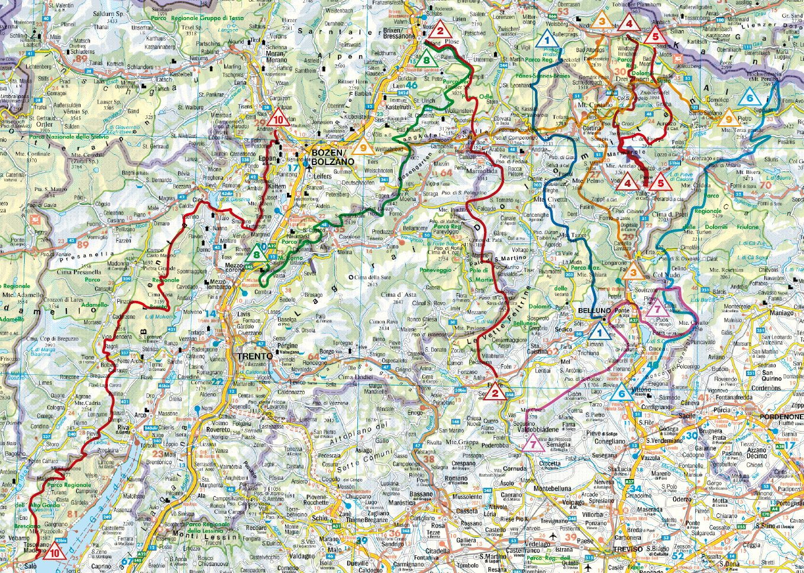

# This is my Project
I will explain my project here

## This is a subheading
Another explanation

* Bullet Point 1
* Bullet Point 2
* Bullet Point 3

``` three backticks initiate a code block
print("Hello NF")
print("Hello NF")
print("Hello NF")
```


